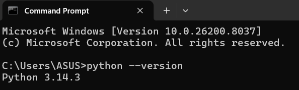
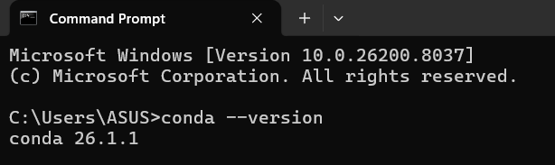
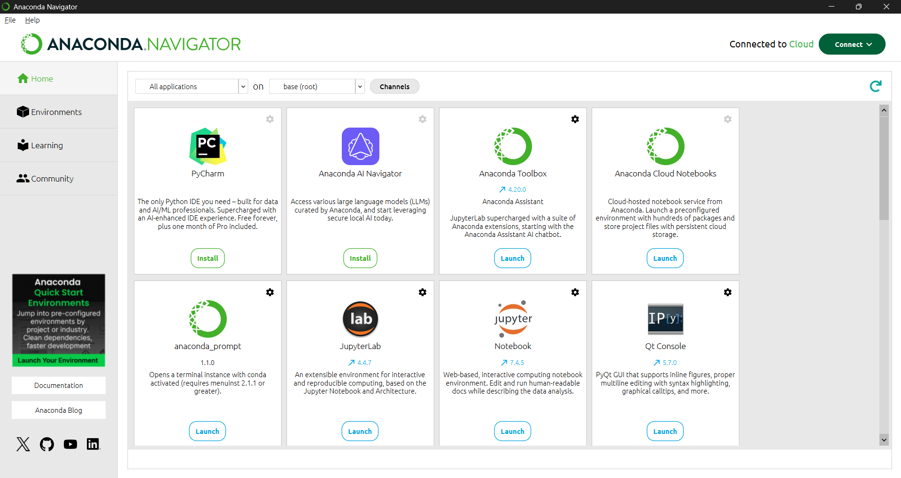
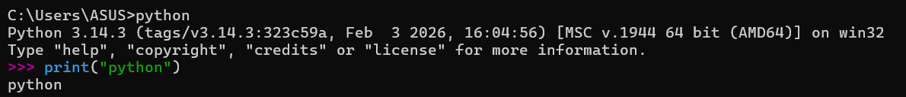
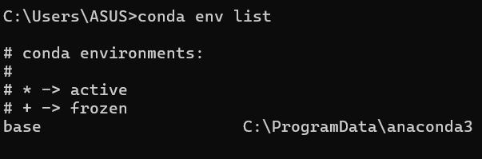

# ***Assignment 4.5*** 

## *Environment Setup Proof*

### Python Installation Verification

---

### Conda Installation Verification

---

### $Anaconda$ $Navigator$

---

### Python Execution Test

---

### Conda Environment Check

---

## Summary

- *Python is successfully installed and accessible via terminal*
- *Anaconda (Conda) is installed and working*
- *Python executes without errors*
- *Environment is ready for Data Science work*

>$🚀$ $PR$ $DETAILS$

$🔹$ $PR$ $Title$

$Milestone$ $1:$ $Python$ & $Anaconda$ $Setup$ $Verification$

$🔹$ $PR$ $Description$

*This PR provides proof that Python and Anaconda are successfully installed and working.*

***The following have been verified:***
- *Python installation via terminal*
- *Conda installation and accessibility*
- *Python execution without errors*
- *Conda environment availability*

***This confirms that the local environment is ready for the Data Science sprint.***