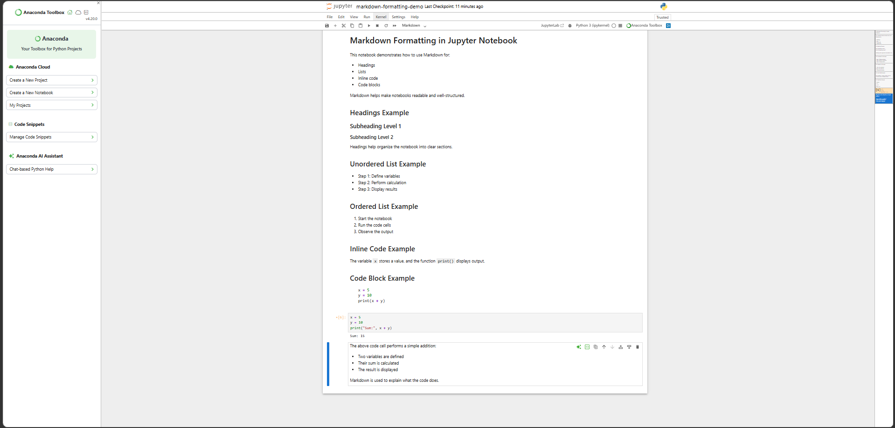

# ***Assignment 4.10*** 

>$🚀$ $PR$ $DETAILS$

$🔹$ $PR$ $Title$

$Milestone$ $6:$ $Markdown$ $Formatting$ $in$ $Jupyter$ $Notebook$

$🔹$ $PR$ $Description$

*This PR demonstrates the use of Markdown in Jupyter Notebook.*

***The notebook includes:***
- *Headings for structure*
- *Ordered and unordered lists*
- *Inline code and code blocks*
- *Proper combination of Markdown and code cells*

***This confirms the ability to create clear and readable notebooks.***

