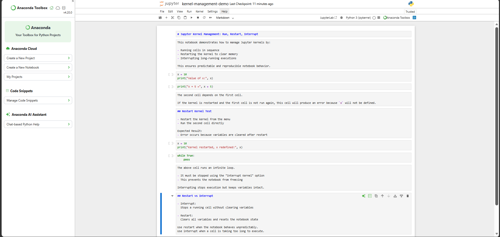

# ***Assignment 4.9*** 

>$🚀$ $PR$ $DETAILS$

$🔹$ $PR$ $Title$

$Milestone$ $5:$ $Jupyter$ $Kernel$ $Management$ $(Run,$ $Restart,$ $Interrupt)$

$🔹$ $PR$ $Description$

*This PR demonstrates understanding of Jupyter kernel management.*

***The notebook includes:***
- *Running cells and understanding execution order*
- *Restarting kernel and observing cleared state*
- *Interrupting a long-running cell*
- *Explanation of restart vs interrupt usage*

***This confirms ability to manage notebook execution safely and predictably.***

