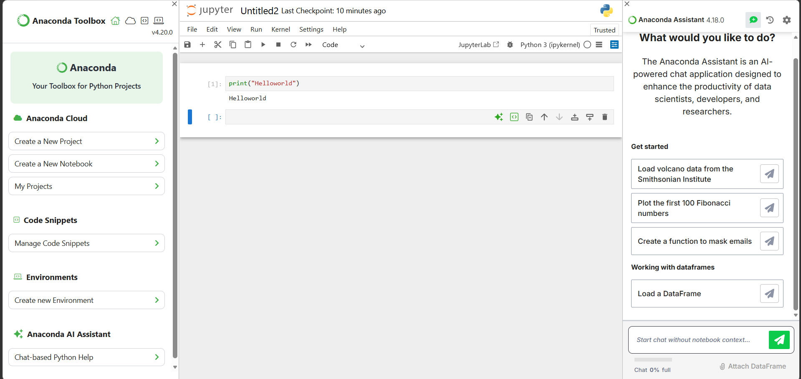

# ***Assignment 4.7*** 

## *Jupyter Notebook Launch & Navigation Verification*

### Environment Used
- $Conda$ $Environment:$ $base$
- $Python$ $Version:$ $3.14.3$

---

### 1. Launching Jupyter Notebook

***Command:***

>$jupyter$ $notebook$

***Verification:***
- *Jupyter Notebook launched successfully from terminal*
- *Opened automatically in browser*
- *Root directory matches the folder from which the command was run*

---

### 2. Jupyter Home Interface Understanding

***Verified the following components:***

- *File/Folder listing area shows current directory contents*
- *Navigation breadcrumbs show current path*
- *"New" button used to create new notebook*
- *File type indicators:*
  - **Folders**
  - **Notebooks (.ipynb)**
  - **Scripts (.py)**

---

### 3. Folder Navigation

**Actions performed:**

- *Navigated into folders using Jupyter interface*
- *Moved back using directory navigation*
- *Located project folder successfully*
- *Confirmed that navigation reflects local file system structure*

---

### 4. Creating and Opening a Notebook

***Steps:***
- *Clicked ***"New"*** → Python 3 Notebook*
- *Notebook created in correct project folder*
- *Opened notebook successfully*

***Verification:***
- *Correct Python kernel selected*
- *Notebook is connected and ready to run code*

---

### 5. Running a Test Cell

---

### 6. Notebook File Management

***Actions performed:***

- *Renamed notebook successfully*
- *Saved notebook*
- *Closed notebook tab*
- *Reopened notebook from Jupyter Home interface*

---

## Summary

- *Jupyter Notebook launches correctly from terminal*
- *Home interface components are understood*
- *Folder navigation works as expected*
- *Notebook creation and execution verified*
- *Basic file management operations completed*

***This confirms readiness to use Jupyter for Data Science workflows.***

>$🚀$ $PR$ $DETAILS$

$🔹$ $PR$ $Title$

$Milestone$ $3:$ $Jupyter$ $Notebook$ $Launch$ & $Navigation$

$🔹$ $PR$ $Description$

*This PR verifies that Jupyter Notebook can be launched and used correctly.*

***The following were validated:***
- *Jupyter launches from terminal*
- *Home interface is understood*
- *Folder navigation works correctly*
- *Notebook creation and execution verified*
- *Basic file management operations completed*

***This confirms readiness to use Jupyter for upcoming Data Science tasks.***