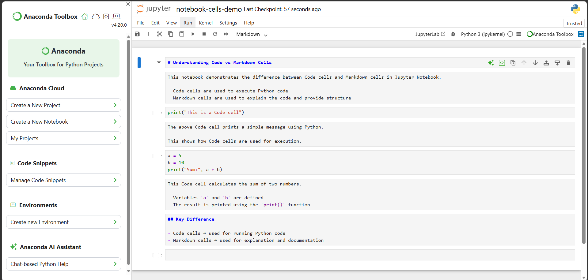

# ***Assignment 4.8*** 

>$🚀$ $PR$ $DETAILS$

$🔹$ $PR$ $Title$

$Milestone$ $4:$ $Code$ $vs$ $Markdown$ $Cells$ $in$ $Jupyter$ $Notebook$

$🔹$ $PR$ $Description$

*This PR demonstrates understanding of Code and Markdown cells in Jupyter Notebook.*

**The notebook includes:**
- *Code cells executing simple Python statements*
- *Markdown cells explaining the code and structure*
- *Clear separation between execution and explanation*

***This confirms the ability to structure notebooks in a readable and professional manner.***

