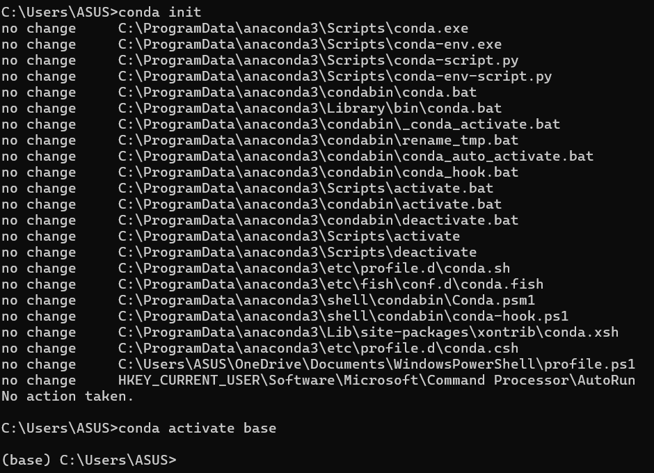

# ***Assignment 4.6***
## *Environment Verification Proof*

### System Information
- $OS:$ $Windows$
- $Python$ $Version:$ $3.14.3$
- $Conda$ $Version:$ $26.1.1$
- $Environment$ $Used:$ $base$

---

### 1. Python Verification

---

### 2. Conda Verification

---

### 3. Jupyter Verification

 
 

---

## Summary

- *Python is installed and runs correctly*
- *Conda is installed and environments are accessible*
- *Environment activation works properly*
- *Jupyter Notebook/Lab launches and executes Python code*

***This confirms the system is ready for Data Science workflows.***
>$🚀$ $PR$ $DETAILS$
- $🔹$ $PR$ $Title$
- $Milestone$ $2:$ $Python,$ $Conda$ & $Jupyter$ $Verification$
- $🔹$ $PR$ $Description$

*This PR verifies that Python, Conda, and Jupyter are correctly set up and working.*

***The following checks were performed:***
- *Python version and execution verified*
- *Conda installation and environment activation verified*
- *Jupyter Notebook/Lab launched and executed Python code successfully*

***This confirms that the local environment is fully functional and ready for the Data Science sprint.***